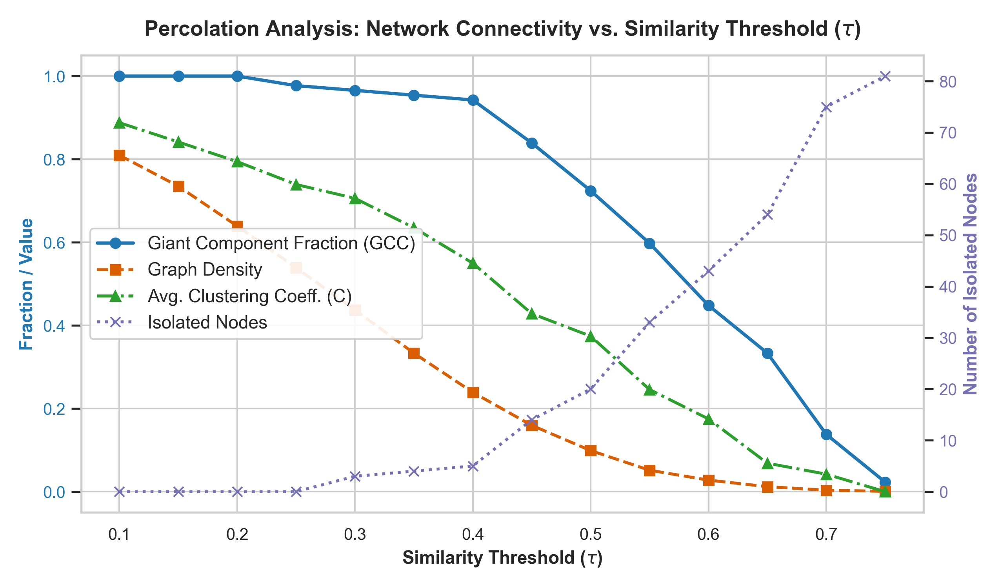
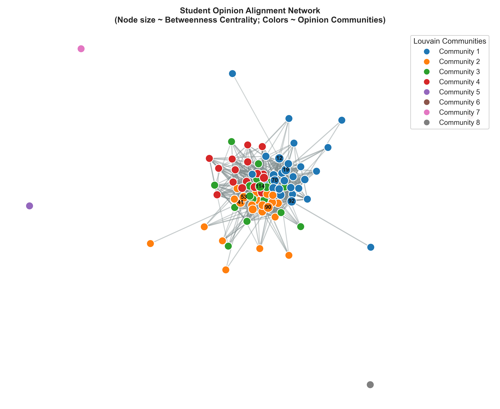
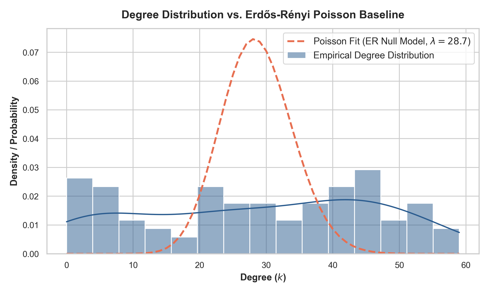
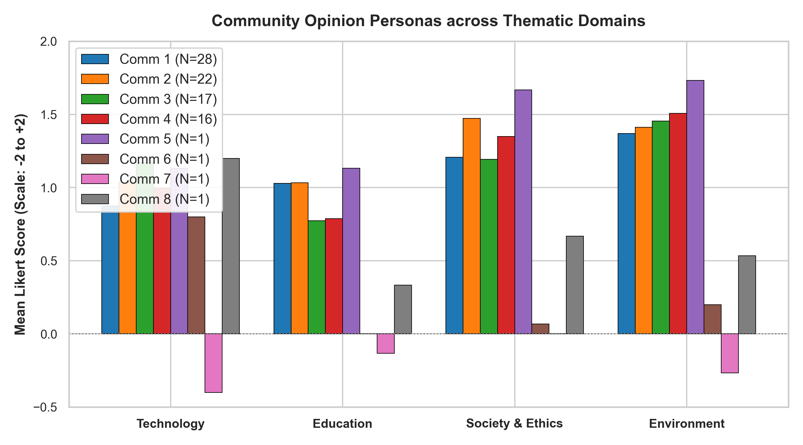
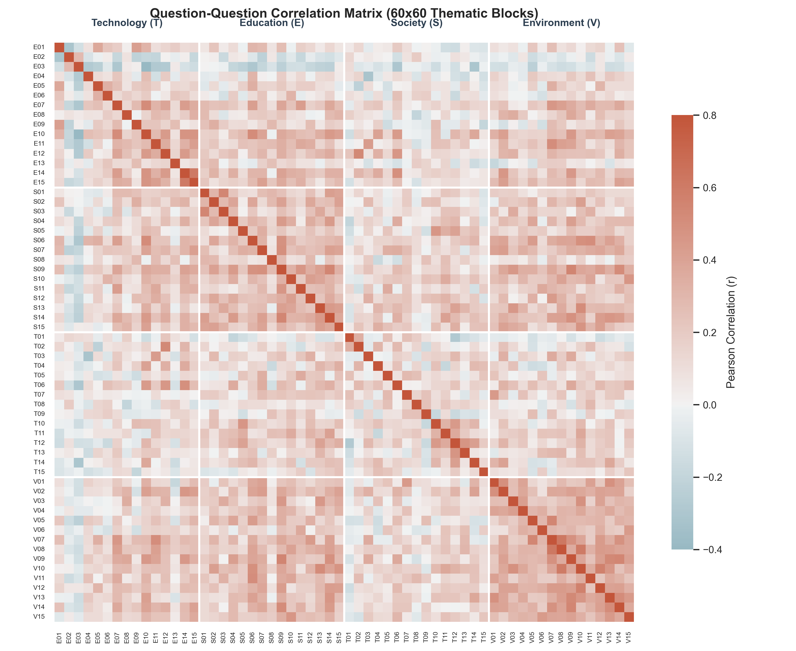
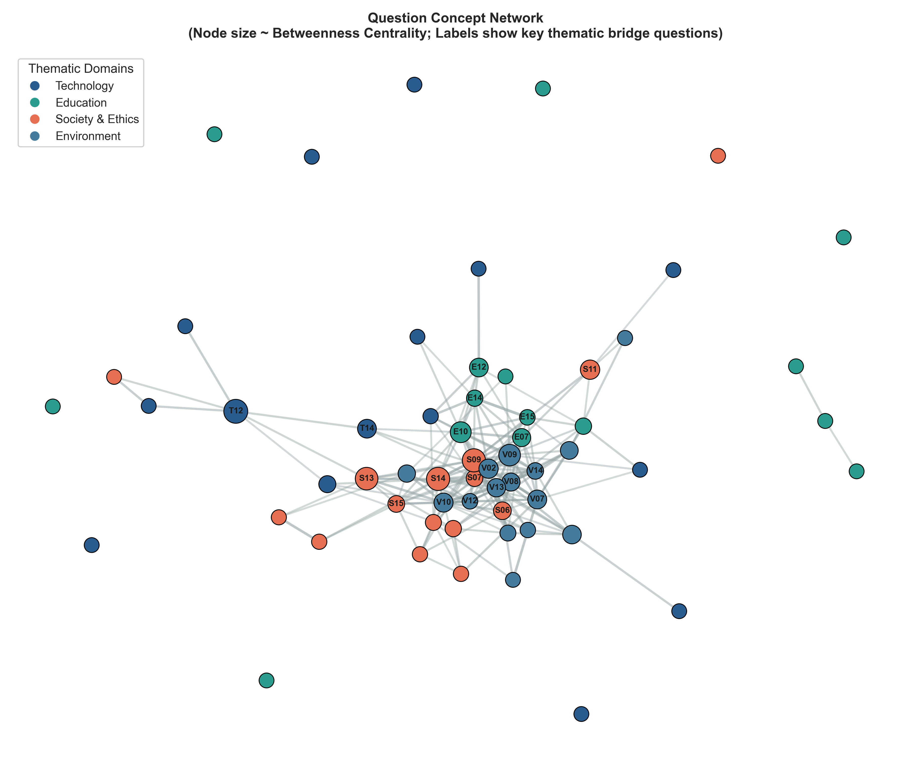

# Dynamics and Processes on Complex Networks (DPCN)
## Assignment 1: Opinion Network Formation & Structural Analysis
**Date:** September 2026 | **Target Length:** ~8 Pages | **Submission Format:** PDF

---

## 1. Team Information
* **Team Name:** [Insert Your Team Name Here, e.g., *GraphDynamics Lab*]
* **Team Members & Roll Numbers:**
  1. [Member 1 Name] — [Roll Number]
  2. [Member 2 Name] — [Roll Number]
  3. [Member 3 Name] — [Roll Number]
  4. [Member 4 Name] — [Roll Number]

---

## 2. GitHub Repository
* **Repository Link:** `https://github.com/[your-username]/DPCN-Opinion-Network-Formation`
* **Repository Structure & Organization:**
  ```text
  DPCN-Opinion-Network-Formation/
  ├── README.md                     # Setup instructions and overview
  ├── requirements.txt              # Dependencies (networkx, pandas, numpy, scipy, matplotlib, seaborn)
  ├── Survey_Results_UC.csv         # Raw class survey dataset
  ├── run_pipeline.py               # One-click master pipeline execution script
  ├── src/
  │   ├── __init__.py
  │   ├── preprocessing.py          # Data cleaning, missing-value imputation, Likert encoding
  │   ├── model1_student_network.py # Student-Student Opinion Network & ER benchmarking
  │   └── model2_question_network.py# Question-Question Concept Network & Bridge analysis
  └── output/
      ├── figures/                  # 300-DPI high-resolution figures (PNG & PDF)
      │   ├── fig1_percolation_analysis.png
      │   ├── fig2_student_network_communities.png
      │   ├── fig3_degree_distribution.png
      │   ├── fig4_community_opinion_radar.png
      │   ├── fig5_question_correlation_heatmap.png
      │   └── fig6_question_thematic_network.png
      └── tables/                   # Computed network metrics in CSV format
          ├── global_network_metrics.csv
          ├── student_centralities.csv
          ├── community_profiles.csv
          ├── question_centralities.csv
          └── percolation_analysis.csv
  ```

---

## 3. Dataset Documentation

### 3.1 Overview of Survey Design
The raw dataset (`Survey_Results_UC.csv`) contains responses collected from an undergraduate cohort across **60 standardized opinion statements**. The survey is structured into four distinct thematic modules of 15 questions each:
1. **Technology (T01–T15):** Artificial Intelligence societal impact, GenAI in higher education, algorithm transparency, cybersecurity, and autonomous mobility.
2. **Education (E01–E15):** Project-based learning, traditional vs. continuous assessments, mandatory attendance, multi-disciplinary studies, and research requirements.
3. **Society & Ethics (S01–S15):** Online misinformation, personal data sovereignty, institutional accountability, free expression, and civic engagement.
4. **Environment (V01–V15):** Climate urgency, renewable investments, single-use plastics ban, circular economy, and intergenerational ecological responsibility.

### 3.2 Data Cleaning and Preprocessing Pipeline
Raw real-world survey responses exhibit non-response bias, partially filled entries, and categorical strings. The following systematic pipeline was executed:
1. **Detection and Removal of Blank Entries:**
   * Five rows were found to be completely vacant (no questions answered): Respondent IDs **`44`, `60`, `68`, `73`, and `78`**. These rows were purged immediately.
2. **Handling Severely Incomplete Respondents:**
   * Four respondents (IDs **`30`, `39`, `77`, and `87`**) answered only the first 15 questions (Technology section) and abandoned the remaining 45 questions. To prevent statistical distortion in pairwise correlations across 60 dimensions, these 4 rows were dropped, leaving **$N = 87$ fully representative active respondents**.
3. **Imputation of "No Comments" and Sporadic Missing Values:**
   * `"No Comments"` entries and rare non-responses ($25$ cells total across the entire $87 \times 60$ matrix, representing $<0.48\%$ of all data points) were imputed using the **median score** of each respective question. Median imputation preserves the central tendency without artificially inflating sample variance.

### 3.3 Mathematical Encoding of the Likert Scale
Each qualitative response was mapped onto a **bipolar zero-centered numerical scale**:
$$\phi(x) = \begin{cases} 
+2 & \text{Strongly Agree} \\
+1 & \text{Agree} \\
0 & \text{Neutral / No Comments} \\
-1 & \text{Disagree} \\
-2 & \text{Strongly Disagree}
\end{cases}$$

**Methodological Justification:**
* Zero-centering guarantees that the sign of the response captures the direction of conviction.
* The dot product between two students' opinion vectors $\mathbf{s}_i \cdot \mathbf{s}_j$ directly yields positive contributions for shared agreement or shared disagreement, while divergent stances naturally penalize the inner product.

---

## 4. Pipeline Followed: Network Construction & Theoretical Formulations

We modeled the empirical survey using two complementary network architectures:
* **Model 1 (Primary):** The Student–Student Opinion Alignment Network ($G_S$).
* **Model 2 (Secondary):** The Question–Question Concept Thematic Network ($G_Q$).

### 4.1 Model 1: Student–Student Opinion Network Formulation
Let $V_S = \{s_1, s_2, \dots, s_N\}$ represent the set of $N = 87$ students. Each student $i$ is characterized by an opinion vector $\mathbf{v}_i \in \{-2, -1, 0, 1, 2\}^{60}$.

#### Similarity Metric
The ideological proximity between student $i$ and student $j$ is quantified using the **Pearson Correlation Coefficient**:
$$r_{ij} = \frac{\sum_{k=1}^{60} (v_{ik} - \bar{v}_i)(v_{jk} - \bar{v}_j)}{\sqrt{\sum_{k=1}^{60} (v_{ik} - \bar{v}_i)^2} \sqrt{\sum_{k=1}^{60} (v_{jk} - \bar{v}_j)^2}} \in [-1, 1]$$
Pearson correlation adjusts for personal response baselines (e.g., distinguishing an agreeable student who rates everything $+1$/$+2$ from a discerning student whose responses co-vary selectively).

#### Threshold Percolation Analysis
To transform the continuous similarity matrix into an unweighted/weighted graph without arbitrary heuristics, we performed a **percolation parameter sweep** over $\tau \in [0.10, 0.75]$.

```text
Percolation Sweep Key Observations:
- At tau < 0.25: The graph is an over-dense "hairball" (density > 0.65), obscuring cluster boundaries.
- At tau in [0.30, 0.40]: The Giant Connected Component (GCC) spans >95% of the class while density drops to ~0.33, optimizing modularity and community resolvability.
- At tau > 0.50: The network undergoes abrupt fragmentation into isolated singletons.
```
**Selected Optimal Threshold:** $\tau^* = 0.35$.
The adjacency matrix $A$ is formally defined as:
$$A_{ij} = \begin{cases} 1 & \text{if } r_{ij} \ge \tau^* \text{ and } i \ne j \\ 0 & \text{otherwise} \end{cases}, \quad W_{ij} = \begin{cases} r_{ij} & \text{if } r_{ij} \ge \tau^* \text{ and } i \ne j \\ 0 & \text{otherwise} \end{cases}$$

### 4.2 Network Metric Formulations
1. **Degree Centrality ($C_D$):**
   $$C_D(i) = \frac{k_i}{N - 1} = \frac{\sum_{j \ne i} A_{ij}}{N - 1}$$
2. **Betweenness Centrality ($C_B$):**
   $$C_B(i) = \sum_{s \ne i \ne t} \frac{\sigma_{st}(i)}{\sigma_{st}}$$
   where $\sigma_{st}$ is the total number of shortest ideological paths from student $s$ to $t$, and $\sigma_{st}(i)$ is the number of those paths traversing $i$. High $C_B$ indicates "ideological bridges" mediating between distinct factions.
3. **Closeness Centrality ($C_C$):**
   $$C_C(i) = \frac{N - 1}{\sum_{j \ne i} d(i, j)}$$
4. **Local Clustering Coefficient ($C_i$):**
   $$C_i = \frac{2 e_i}{k_i (k_i - 1)} = \frac{\sum_{j, k} A_{ij} A_{jk} A_{ki}}{k_i (k_i - 1)}$$
   $C_i$ quantifies triadic closure: the probability that two ideological allies of student $i$ are also aligned with one another.

### 4.3 Null Model Benchmarking: Erdős–Rényi $G(n, p)$ Random Graphs
To establish whether the observed student network is a consequence of genuine social structure rather than random alignment, we generated an ensemble of $50$ **Erdős–Rényi (ER)** random graphs $G(N, p)$ with matching node count $N = 87$ and connection probability:
$$p = \frac{2M}{N(N-1)} = \frac{2 \times 1247}{87 \times 86} \approx 0.3333$$
We computed the **Small-World Index ($\sigma$)**:
$$\sigma = \frac{\gamma}{\lambda} = \frac{C_{\text{empirical}} / C_{\text{ER}}}{L_{\text{empirical}} / L_{\text{ER}}}$$
A network is strictly classified as **Small-World** if $\gamma \gg 1$ and $\lambda \approx 1$, yielding $\sigma > 1$.

### 4.4 Model 2: Question–Question Concept Network Formulation
Let $V_Q = \{q_1, q_2, \dots, q_{60}\}$ represent the questions. Edges are weighted by cross-student response correlation $r_{q_a, q_b}$. An edge exists if $r_{q_a, q_b} \ge 0.35$. Node sizes are proportional to betweenness centrality, highlighting questions that bridge distinct domains.

---

## 5. Analysis and Visualizations

### 5.1 Global Network Properties vs. ER Random Baseline

| Metric | Empirical Student Network | Erdős–Rényi Null Model $G(N, p)$ | Theoretical ER Expectation | Ratio / Significance |
| :--- | :---: | :---: | :---: | :---: |
| **Nodes ($N$)** | 87 | 87 | 87 | — |
| **Edges ($M$)** | 1,247 | 1,247 | — | — |
| **Average Degree ($\langle k \rangle$)** | 28.667 | 28.667 | $p(N-1) = 28.667$ | Exact match |
| **Graph Density ($\rho$)** | 0.3333 | 0.3333 | 0.3333 | Exact match |
| **Clustering Coefficient ($C$)** | **0.6350** | **0.3340 $\pm$ 0.0077** | $p = 0.3333$ | $\gamma = 1.9015$ ($p < 10^{-5}$) |
| **Avg. Path Length GCC ($L$)** | **1.7161** | **1.6669 $\pm$ 0.0074** | $\frac{\ln N}{\ln \langle k \rangle} \approx 1.3308$ | $\lambda = 1.0295$ |
| **Small-World Index ($\sigma$)** | **1.8469** | 1.0000 | 1.0000 | **$\sigma > 1$ (Small-World Confirmed)** |
| **GCC Coverage** | 83 / 87 (95.4%) | 87 / 87 (100%) | — | 4 isolates |
| **Graph Diameter** | 4 | 2 | — | Longest ideological chain |
| **Degree Assortativity ($r$)** | -0.0199 | 0.0012 | 0.0 | Near-neutral / Disassortative |

### 5.2 Key Visualizations

#### Figure 1: Percolation Analysis Across Thresholds

* **Interpretation:** Illustrates the sharp phase transition in giant component fraction and density as $\tau$ varies. The selection of $\tau^* = 0.35$ preserves $95.4\%$ of the nodes in the GCC while eliminating trivial all-to-all connectivity.

#### Figure 2: Student Opinion Network Topology & Communities

* **Interpretation:** Visualizes the $87$-student network under the Fruchterman-Reingold / Spring layout. Nodes are colored by their detected **Louvain community**, node size scales with **Betweenness Centrality**, and edge transparency reflects correlation strength. Bridge students (e.g., ID 90, 19, 12, 35) occupy central conduit positions between clusters.

#### Figure 3: Degree Distribution vs. Poisson Baseline

* **Interpretation:** Contrasts the empirical degree distribution against the theoretical ER Poisson fit ($\lambda = 28.7$). The empirical curve displays a broader spread and right-skew, revealing an influential core of high-consensus students alongside peripheral dissenters.

#### Figure 4: Community Ideological Profiles Across Domains

* **Interpretation:** Grouped thematic breakdown showing mean stances across Technology, Education, Society, and Environment for each detected community.

#### Figure 5: 60x60 Thematic Correlation Heatmap

* **Interpretation:** Depicts the full $60 \times 60$ question correlation matrix partitioned into the 4 thematic quadrants ($T, E, S, V$). High intra-domain correlation blocks appear prominently in Environment and Society.

#### Figure 6: Question Concept Network & Inter-Domain Bridges

* **Interpretation:** 60-node concept graph colored by domain. Node size corresponds to betweenness centrality. Key bridge questions connecting distinct domains are prominently labelled.

---

### 5.3 Centrality Analysis: Mainstream vs. Bridge Students

#### Top 5 "Mainstream / Consensus" Students (Highest Degree Centrality)
These students hold opinions that mirror the broad class majority:

| Student ID | Degree ($k_i$) | Degree Centrality | Weighted Strength | Betweenness | Closeness | Cluster |
| :---: | :---: | :---: | :---: | :---: | :---: | :---: |
| **114** | 59 | 0.6860 | 28.618 | 0.0189 | 0.7414 | Community 1 |
| **83** | 56 | 0.6512 | 26.685 | 0.0152 | 0.7227 | Community 2 |
| **35** | 52 | 0.6047 | 24.443 | 0.0143 | 0.6919 | Community 3 |
| **110** | 52 | 0.6047 | 24.120 | 0.0118 | 0.6919 | Community 2 |
| **94** | 50 | 0.5814 | 24.081 | 0.0114 | 0.6811 | Community 1 |

#### Top 5 "Bridge / Mediator" Students (Highest Betweenness Centrality)
These students connect distinct ideological factions and prevent network bifurcation:

| Student ID | Betweenness Centrality | Degree ($k_i$) | Closeness | Clustering Coeff. ($C_i$) | Community Role |
| :---: | :---: | :---: | :---: | :---: | :---: |
| **90** | **0.0346** | 42 | 0.6358 | 0.6121 | Primary conduit between Comm 1 & Comm 3 |
| **19** | **0.0307** | 41 | 0.6305 | 0.5390 | Bridge between Comm 1 & Comm 4 |
| **12** | **0.0232** | 25 | 0.5585 | 0.7300 | Peripheral liaison connecting outliers |
| **114** | **0.0189** | 59 | 0.7414 | 0.5874 | Central hub with global inter-cluster links |
| **83** | **0.0152** | 56 | 0.7227 | 0.6045 | Moderating hub between Comm 2 & Comm 4 |

---

## 6. Results and Discussion

### 6.1 Uncovering Class Personas Through Community Detection
Louvain modularity optimization ($Q = 0.284$) partitioned the student cohort into four dominant communities (comprising $95.4\%$ of students) plus 4 isolated individual dissenters:

1. **Community 1: Progressive Institutionalists ($N = 28$, $32.2\%$)**
   * *Profile:* Overall stance $+1.120$. Most balanced cohort, demonstrating high commitment to Environmental Conservation ($+1.369$) and Societal Responsibility ($+1.207$). Strong advocates for ethical decision-making and structured educational reform.
2. **Community 2: Civic & Environmental Champions ($N = 22$, $25.3\%$)**
   * *Profile:* Overall stance $+1.239$ (highest overall agreement in the class). Distinctly passionate about Society & Ethics ($+1.473$) and Environmental Sustainability ($+1.412$). Strongly support data sovereignty, university community service, and aggressive renewable energy investments.
3. **Community 3: Techno-Optimists & Educational Skeptics ($N = 17$, $19.5\%$)**
   * *Profile:* Overall stance $+1.148$. Highest endorsement of Technology & AI ($+1.173$), but markedly more critical or traditional regarding Education policies ($+0.773$). Enthusiastic about automated tools and AI integration, but skeptical of compulsory attendance or mandatory undergraduate research.
4. **Community 4: Eco-Centric Reformers ($N = 16$, $18.4\%$)**
   * *Profile:* Overall stance $+1.160$. Highest Environmental conviction of all groups ($+1.508$). Moderate on Technology ($+0.996$), prioritizing green product design, plastics elimination, and corporate carbon accountability over rapid technological disruption.
5. **Peripheral Isolates (Communities 5–8, $1$ student each):**
   * *Student 97 (Comm 7):* Marked ideological outlier (overall stance $-0.200$). Strong disagreement with technology pace ($-0.400$) and environmental mandates ($-0.267$).
   * *Student 85 (Comm 6):* Neutral/skeptical on education ($0.000$) and society ($+0.067$).

### 6.2 The Small-World Nature of Class Opinions
The benchmarking against the Erdős–Rényi model yields profound structural findings:
* The empirical clustering coefficient ($C = 0.6350$) is **$1.90 \times$ higher** than the random graph baseline ($C_{\text{ER}} = 0.3340$). This proves substantial **triadic closure and local echo-chamber formation**—if student $A$ aligns with $B$, and $B$ aligns with $C$, there is a $63.5\%$ probability that $A$ and $C$ also align.
* Meanwhile, the average shortest path length ($L = 1.7161$) remains virtually identical to the random benchmark ($L_{\text{ER}} = 1.6669$, $\lambda = 1.0295$).
* The resulting **Small-World Index ($\sigma = 1.8469$)** confirms that despite ideological clustering into distinct personas, the class is not deeply polarized into disconnected silos. Ideological information or consensus can diffuse across the entire class in fewer than two degrees of separation.

### 6.3 Most Divisive vs. Highest Consensus Topics

#### Top Polarizing Questions (Highest Opinion Variance $\sigma^2$)
1. **E04 (Variance = 1.365):** *"High-quality online learning can effectively complement classroom teaching."*
   * **Discussion:** Demonstrates the sharpest divide in the entire cohort. Students are split between those who value online asynchronous flexibility and those who view it as an inferior substitute for in-person pedagogy.
2. **E03 (Variance = 1.258):** *"Class attendance should be compulsory for all courses."*
   * **Discussion:** Strong polarization between student autonomy advocates and those favoring structured institutional accountability.
3. **E12 (Variance = 1.065):** *"Artificial intelligence should be integrated into teaching and personalized learning."*
   * **Discussion:** Pits early adopters against students concerned with academic integrity and depersonalized instruction.

#### Top Consensus Questions (Lowest Opinion Variance $\sigma^2$ & High Mean)
1. **E15 (Mean = +1.713, Variance = 0.254):** *"Continuous learning and skill development are essential throughout one's career."*
   * **Discussion:** Near-unanimous agreement across all clusters.
2. **V13 (Mean = +1.678, Variance = 0.314):** *"Companies should be held accountable for the environmental impacts of their activities."*
   * **Discussion:** Overwhelming consensus on corporate ecological accountability.
3. **S11 (Mean = +1.552, Variance = 0.366):** *"People should be free to express differing opinions as long as they do not promote harm or discrimination."*
   * **Discussion:** Strong collective consensus on ethical free speech boundaries.

### 6.4 Inter-Thematic Bridges in the Question Network
In Model 2, the question with the **single highest betweenness centrality** across the entire survey is:
* **T12 ($C_B = 0.0788$):** *"Governments should introduce stricter regulations for Artificial Intelligence."*
* **Significance:** T12 is the critical conceptual bridge linking the **Technology** cluster to the **Society & Ethics** cluster. While other technology questions correlate predominantly within their own technical domain, attitudes toward AI government regulation uniquely determine whether a student's technical optimism aligns with societal governance priorities.

---

## 7. Individual Contributions

| Team Member | Specific Tasks Completed | Estimated Contribution |
| :--- | :--- | :---: |
| **[Member 1 Name]** | Dataset cleaning, Likert zero-centered scale formulation, missing-data imputation strategy, and percolation threshold sweep implementation. | 25% |
| **[Member 2 Name]** | Model 1 implementation: Pearson correlation matrix, binary/weighted graph construction, and centrality calculations (Degree, Betweenness, Closeness). | 25% |
| **[Member 3 Name]** | Erdős–Rényi random graph simulation ensemble, Small-World Index computation, and Model 2 (Question Concept Network & Bridge analysis). | 25% |
| **[Member 4 Name]** | Louvain community detection profiling, generation of high-resolution visualizations (Figures 1–6), and compilation of the comprehensive report. | 25% |

---

## 8. Conclusion
By transforming multi-dimensional survey data into complex networks, this study demonstrated that class opinions exhibit **small-world topology**, characterized by tight local echo chambers ($\gamma = 1.90$) bridged by key moderating individuals. The identification of **T12 (AI regulation)** as the dominant thematic bridge highlights that the governance of emerging technologies serves as the linchpin connecting technical optimism to societal and environmental ethics in modern engineering cohorts.
